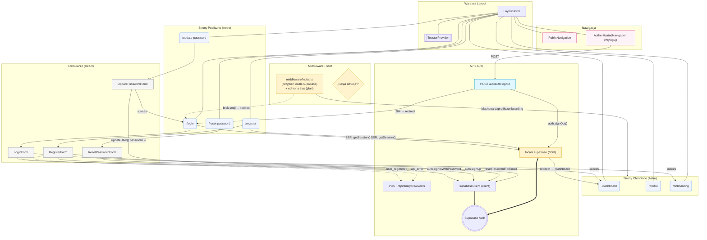

<architecture_analysis>

1. Komponenty uczestniczące w autentykacji (z kodu i specyfikacji)

- Strony (Astro): `src/pages/login.astro`, `src/pages/register.astro`, `src/pages/reset-password.astro`, `src/pages/update-password.astro`, chronione: `src/pages/dashboard.astro`, `src/pages/profile.astro`, `src/pages/onboarding.astro`, layout: `src/layouts/Layout.astro`.
- Formularze (React): `LoginForm.tsx`, `RegisterForm.tsx`, `ResetPasswordForm.tsx`, `UpdatePasswordForm.tsx`.
- Nawigacja: `PublicNavigation.tsx` (goście), `AuthenticatedNavigation.tsx` (z przyciskiem Wyloguj → POST `/api/auth/logout`).
- Powiadomienia: `ToasterProvider.tsx`.
- Middleware/SSR: `src/middleware/index.ts` (przypisanie `locals.supabase`, redirect zalogowanych z `/` → `/dashboard`, planowana ochrona tras).
- Klient Supabase: `src/db/supabase.client.ts` (client-side, obecnie bez wariantu SSR z cookies).
- API: istniejące (`/api/analytics/events`, `/api/preferences`, `/api/meal-plans/*`), planowany endpoint: `POST /api/auth/logout`.
- Planowany kontekst stanu: `AuthProvider` (inicjalizacja store z danych SSR przekazywanych z Astro).

2. Główne strony i ich komponenty

- login.astro → `LoginForm` (+ `ToasterProvider`), SSR: `prerender = false`, check sesji → redirect `/dashboard`.
- register.astro → `RegisterForm` (+ `ToasterProvider`), SSR: `prerender = false`, check sesji → redirect `/dashboard`.
- reset-password.astro → `ResetPasswordForm` (publiczna, bez SSR check).
- update-password.astro → `UpdatePasswordForm` (publiczna, recovery flow Supabase).
- dashboard.astro, profile.astro, onboarding.astro → chronione (docelowo przez middleware), korzystają z `AuthenticatedNavigation` z przyciskiem „Wyloguj”.

3. Przepływ danych (wysoki poziom)

- Strony login/register wykonują SSR `supabase.auth.getSession()` (przez `Astro.locals.supabase`) → jeśli sesja istnieje: redirect do `/dashboard`.
- Formularze `LoginForm`/`RegisterForm` wywołują odpowiednio `supabaseClient.auth.signInWithPassword` i `supabaseClient.auth.signUp` → sukces: toast → redirect (dashboard / onboarding).
- `ResetPasswordForm` → `auth.resetPasswordForEmail(email, { redirectTo: /update-password })` → email z linkiem recovery → `UpdatePasswordForm` → `auth.updateUser({ password })` → redirect `/login`.
- `AuthenticatedNavigation` → „Wyloguj” → POST `/api/auth/logout` (nowy endpoint) → `auth.signOut()` po stronie serwera → redirect (`/` lub `/login`).
- Middleware (docelowo): PROTECTED_PATHS (`/dashboard`, `/profile`, `/onboarding`) → brak sesji: redirect `/login?redirectTo=...`; zalogowani nie wejdą na `/login`, `/register`.
- (Opcjonalnie, wg PRD/spec) Zdarzenia analytics: `user_registered`, `api_error` wysyłane do `/api/analytics/events`.

4. Opis ról/funkcjonalności

- `Layout.astro`: szkielet HTML, miejsce na content i provider toasta.
- `PublicNavigation`/`AuthenticatedNavigation`: nawigacja dla gościa/zalogowanego; w tej drugiej obsługa wylogowania (fallback czyszczenia localStorage do czasu endpointu SSR).
- `LoginForm`/`RegisterForm`: stan, walidacja, integracja Supabase Auth, toasty, redirecty.
- `ResetPasswordForm`/`UpdatePasswordForm`: reset hasła (link email → recovery → ustaw nowe hasło), komunikaty PL, redirect.
- `middleware/index.ts`: przypisuje `locals.supabase`; plan: pełna ochrona tras i SSR Supabase z cookies.
- `supabase.client.ts`: klient Supabase (klient), docelowo również klient SSR w middleware.
- `POST /api/auth/logout` (nowy): bez body, 204 No Content na sukces, 500 na błąd (spójny JSON błędu), wykonuje `auth.signOut()` po stronie serwera.
- `AuthProvider` (planowany): inicjalizacja auth store po stronie klienta na podstawie danych SSR przekazanych jako props.
  </architecture_analysis>

<mermaid_diagram>

</mermaid_diagram>
